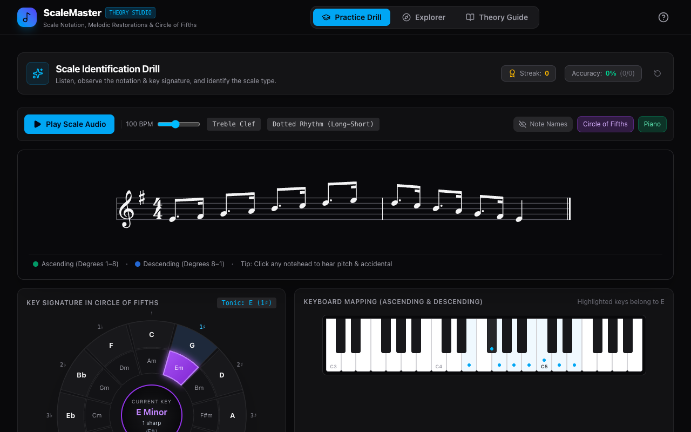

# ScaleMaster — Music Theory & Notation Trainer

[](https://benjaminpritchard.github.io/scale_quiz/)

An interactive web-based trainer and quiz for mastering musical scales, sheet music notation, key signatures, and the Circle of Fifths.

> 🌐 **Play it live**: [https://benjaminpritchard.github.io/scale_quiz/](https://benjaminpritchard.github.io/scale_quiz/)

---

## Screenshot

<!-- Screenshot Stub: Will be added once deployed -->


---

## About & AI Generation

This application was generated by **Google Gemini** using the **Gemini 2.5 Flash** model via Google AI Studio.

It is a 100% client-side application built with modern web technologies:
- **Sheet Music Engraving**: Rendered with **VexFlow 5** using the **Bravura** music font.
- **Audio**: Real-time instrument playback synthesized in the browser via the **Web Audio API** (zero external audio files or soundfonts needed).
- **Frontend**: React 19, TypeScript, Tailwind CSS, Motion animations, and Lucide Icons.

---

## Features

- **Interactive Scale Quiz**: Test your recognition of scales directly on the musical staff across treble and bass clefs.
- **Scale Explorer**: Explore Major, Natural Minor, Harmonic Minor, and Melodic Minor scales in all keys with instant auditory playback.
- **Interactive Circle of Fifths**: Explore key signatures, relative majors/minors, and accidental counts visually.
- **Interactive Piano Keyboard**: See corresponding notes highlighted on a virtual keyboard in sync with the staff.
- **Real-Time Sound Synthesis**: Play back scales and individual notes directly in your browser.

---

## Running Locally

1. **Install dependencies**:
   ```bash
   npm install
   ```

2. **Start development server**:
   ```bash
   npm run dev
   ```
   Open [http://localhost:3000](http://localhost:3000) in your browser.

3. **Build static bundle**:
   ```bash
   npm run build
   ```
   The production-ready static assets will be compiled into the `dist/` directory.

4. **Deploy to GitHub Pages**:
   ```bash
   npm run deploy
   ```
   This automatically builds the project and pushes the `dist/` folder to the `gh-pages` branch.

